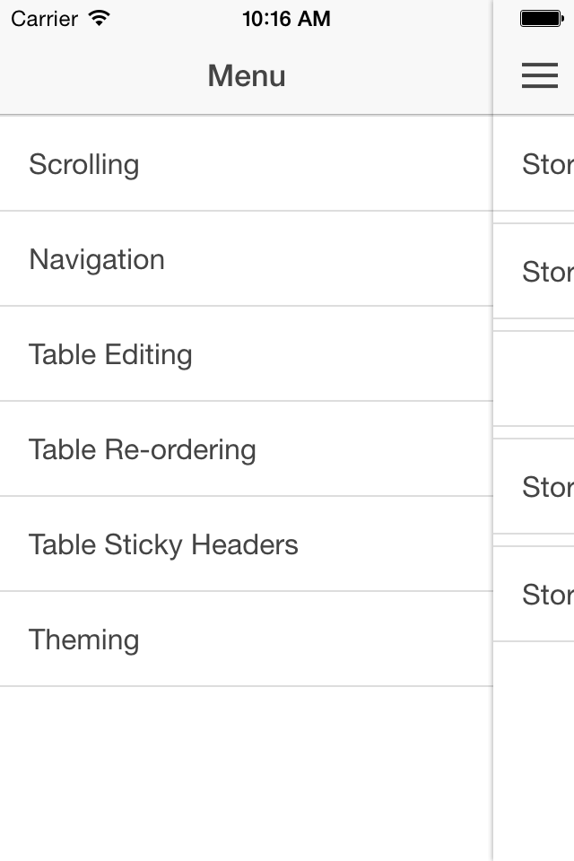

ionicDemohApp
================

### What is this repository for? ###

* This is a simple app that I'm using to learn the basic concepts of Ionic and to demonstrate how it could help us develop a cross-platform mobile app.
* Version 1.0

### How do I get set up? ###

* Simply clone this repo
* Follow steps 1 and 3 of [Getting started with Ionic] (http://ionicframework.com/getting-started/)
  * Note: for step 3 "myApp" corresponds to this app's path and name "ionicDemoApp"
  * Note: you probably have to run "npm install" to get all node dependencies

### Who do I talk to? ###

* [Miguel Fermin] (mailto:mfermin@newstex.com)
